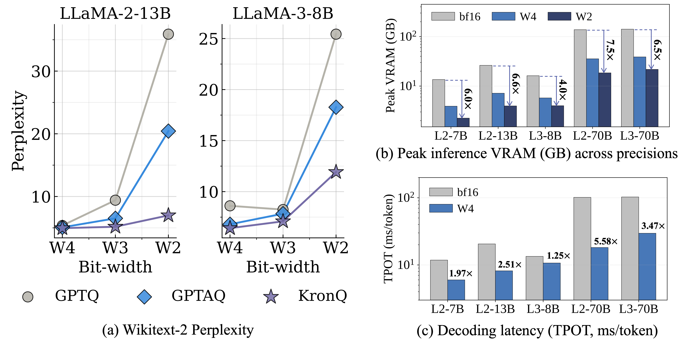

<h2 align="center">KronQ: LLM Quantization via a Kronecker-Factored Hessian</h2>

<p align="center">
  <a href="https://scholar.google.com/citations?user=3-6c0TkAAAAJ">Donghyun Lee</a> ·
  <a href="https://scholar.google.com/citations?user=3UzXL-AAAAAJ">Yuhang Li</a> ·
  <a href="https://scholar.google.com/citations?user=MF1nKn4AAAAJ">Ruokai Yin</a> ·
  <a href="https://scholar.google.com/citations?user=qA5WsYUAAAAJ">Priyadarshini Panda</a>
</p>

<h3 align="center">COLM 2026</h3>

<p align="center">
  <a href="https://arxiv.org/abs/2607.07964"></a>
  <a href="https://huggingface.co/donghyunli"></a>
  <a href="LICENSE"></a>
  
</p>

<p align="center">
  
</p>

KronQ extends GPTQ/GPTAQ with an **output-side** curvature term $H_G$ alongside the
usual **input-side** Hessian $H_X$, under a K-FAC factorization $H \approx H_X \otimes H_G$.
This output curvature drives two mechanisms that improve low-bit (W2–W4) **weight-only**
quantization with **no fine-tuning**:

- **Bidirectional incoherence processing (BiIP)** — incoherence rotation + rescaling on *both* the input and output sides.
- **Inter-layer mixed precision** — per-sublayer bit allocation guided by $\mathrm{tr}(H_G)\cdot\mathrm{tr}(H_X)$ sensitivity.

Quantized weights are stored **packed int4/int2**; a fused dequant + BiIP CUDA matvec
unpacks them on the fly (int-weight × fp16-activation), CUDA-graph wrapped for
single-token decode. On Llama-2-7B (A100, batch 1) the deploy path runs at
**6.30 ms/token** for both W2 and W4 (vs 11.6 ms fp16), and WikiText-2 PPL matches the
research pipeline exactly (bf16 5.47 / W4 5.56 / W2 8.23).

## Contents
- [Installation](#installation)
- [Quick start — run a released model](#quick-start)
- [Model zoo](#model-zoo)
- [Reproduce from scratch](#reproduce)
- [Repository layout](#layout)
- [Citation](#citation) · [Contact](#contact) · [Acknowledgements & License](#license)

<a name="installation"></a>
## Installation

```bash
# Turnkey (brings its own nvcc 12.1 so the CUDA kernels build anywhere):
conda env create -f environment.yml
conda activate kronq

# OR with an existing CUDA-12.1 toolkit on PATH (e.g. `module load CUDA/12.1.1`):
pip install -r requirements.txt --extra-index-url https://download.pytorch.org/whl/cu121

# Build the CUDA extensions (needs nvcc):
pip install git+https://github.com/Dao-AILab/fast-hadamard-transform  # required by all paths
pip install ./runtime/kronq_kernels   # only for the packed-int deploy path
```

<a name="quick-start"></a>
## Quick start — run a released model

Evaluate a pre-quantized KronQ checkpoint straight from the 🤗 Hub — WikiText-2 PPL
and/or zero-shot. No calibration code involved (uses only `common/` + `runtime/`).

```bash
python eval_pretrained.py meta-llama/Llama-2-7b-hf donghyunli/Llama-2-7b-KronQ-W4A16 --ppl --zs
```

The first argument supplies the architecture + tokenizer; the second is the packed
KronQ repo (a **Hub id** or a **local packed dir**). For the 70B models add
`--distribute` to shard across all visible GPUs.

<a name="model-zoo"></a>
## Model zoo

All checkpoints live under 🤗 **[donghyunli](https://huggingface.co/donghyunli)**.
**W4 / W2** are real **packed** int4 / int2; **W3** is shipped as **fp16 fake-quant**
(3-bit is not bit-packable). Suffix `g128` = group-size 128; no suffix = per-channel.

| Base model | per-channel | group-128 |
|---|---|---|
| **Llama-2-7B**  | [W4](https://huggingface.co/donghyunli/Llama-2-7b-KronQ-W4A16) · [W3](https://huggingface.co/donghyunli/Llama-2-7b-KronQ-W3A16-fake) · [W2](https://huggingface.co/donghyunli/Llama-2-7b-KronQ-W2A16) | [W4](https://huggingface.co/donghyunli/Llama-2-7b-KronQ-W4A16-g128) · [W3](https://huggingface.co/donghyunli/Llama-2-7b-KronQ-W3A16-g128-fake) · [W2](https://huggingface.co/donghyunli/Llama-2-7b-KronQ-W2A16-g128) |
| **Llama-2-13B** | [W4](https://huggingface.co/donghyunli/Llama-2-13b-KronQ-W4A16) · [W3](https://huggingface.co/donghyunli/Llama-2-13b-KronQ-W3A16-fake) · [W2](https://huggingface.co/donghyunli/Llama-2-13b-KronQ-W2A16) | [W4](https://huggingface.co/donghyunli/Llama-2-13b-KronQ-W4A16-g128) · [W3](https://huggingface.co/donghyunli/Llama-2-13b-KronQ-W3A16-g128-fake) · [W2](https://huggingface.co/donghyunli/Llama-2-13b-KronQ-W2A16-g128) |
| **Llama-2-70B** | [W4](https://huggingface.co/donghyunli/Llama-2-70b-KronQ-W4A16) · [W3](https://huggingface.co/donghyunli/Llama-2-70b-KronQ-W3A16-fake) · [W2](https://huggingface.co/donghyunli/Llama-2-70b-KronQ-W2A16) | [W4](https://huggingface.co/donghyunli/Llama-2-70b-KronQ-W4A16-g128) · [W3](https://huggingface.co/donghyunli/Llama-2-70b-KronQ-W3A16-g128-fake) · [W2](https://huggingface.co/donghyunli/Llama-2-70b-KronQ-W2A16-g128) |
| **Llama-3-8B**  | [W4](https://huggingface.co/donghyunli/Meta-Llama-3-8B-KronQ-W4A16) · [W3](https://huggingface.co/donghyunli/Meta-Llama-3-8B-KronQ-W3A16-fake) · [W2](https://huggingface.co/donghyunli/Meta-Llama-3-8B-KronQ-W2A16) | [W4](https://huggingface.co/donghyunli/Meta-Llama-3-8B-KronQ-W4A16-g128) · [W3](https://huggingface.co/donghyunli/Meta-Llama-3-8B-KronQ-W3A16-g128-fake) · [W2](https://huggingface.co/donghyunli/Meta-Llama-3-8B-KronQ-W2A16-g128) |
| **Llama-3-70B** | [W4](https://huggingface.co/donghyunli/Meta-Llama-3-70B-KronQ-W4A16) · [W3](https://huggingface.co/donghyunli/Meta-Llama-3-70B-KronQ-W3A16-fake) · [W2](https://huggingface.co/donghyunli/Meta-Llama-3-70B-KronQ-W2A16) | [W4](https://huggingface.co/donghyunli/Meta-Llama-3-70B-KronQ-W4A16-g128) · [W3](https://huggingface.co/donghyunli/Meta-Llama-3-70B-KronQ-W3A16-g128-fake) · [W2](https://huggingface.co/donghyunli/Meta-Llama-3-70B-KronQ-W2A16-g128) |

<a name="reproduce"></a>
## Reproduce from scratch

```bash
# 1) Get the H_G (output-curvature) cache. Either DOWNLOAD the companion dataset...
huggingface-cli download donghyunli/Llama-2-7b-KronQ-HG --repo-type dataset \
    --local-dir grad_cache/llama-2-7b
#    ...or precompute it yourself (one-time per model):
# python calib/precompute_gradients.py --model meta-llama/Llama-2-7b-hf \
#     --output grad_cache/llama-2-7b --nsamples 128

# 2) Quantize (fake-quant) + WikiText-2 PPL — kronq_kernels not needed here.
python main.py --model meta-llama/Llama-2-7b-hf \
    --w_bits 4 --w_groupsize -1 --w_clip --w_asym --a_bits 16 --act_order \
    --bi_calibration --use_gptaq --incoh_rotate --incoh_kernel had --incoh_mode full \
    --alpha 0.25 --grad_dir grad_cache/llama-2-7b

# 3) Save the packed Hub artifact directly (~bits/16 the size of fp16) by adding to step 2:
#    --save_unrotated_kronq --save_packed packed_dir
```

**Companion $H_G$ caches** (one per base model — the `--grad_dir` for step 2; layer-wise
`layer_N/<sublayer>_G.pt`, drop-in for any bit-width):
[Llama-2-7B](https://huggingface.co/datasets/donghyunli/Llama-2-7b-KronQ-HG) ·
[Llama-2-13B](https://huggingface.co/datasets/donghyunli/Llama-2-13b-KronQ-HG) ·
[Llama-2-70B](https://huggingface.co/datasets/donghyunli/Llama-2-70b-KronQ-HG) ·
[Llama-3-8B](https://huggingface.co/datasets/donghyunli/Meta-Llama-3-8B-KronQ-HG) ·
[Llama-3-70B](https://huggingface.co/datasets/donghyunli/Meta-Llama-3-70B-KronQ-HG)

A full one-command demo (precompute → quantize → deploy benchmark + generation) is in
[`scripts/run_example.sh`](scripts/run_example.sh).

**Mapping paper results to flags** (all on `main.py`):

| Result | Flags |
|---|---|
| Weight-only PPL (per-channel) | base recipe above, `--alpha 0.25` |
| Group-128 weight-only | add `--w_groupsize 128` |
| Inter-layer mixed precision | add `--inter_layer_mp N` (upgrade top-N sensitive sublayer types by +1 bit) |
| Component ablation | vary `--incoh_mode {full,no_rescale,su_only,sv_only}` and toggle `--use_gptaq` |
| Weight-and-activation | add `--rotate --enable_aq_calibration --a_bits 4 --a_asym --a_clip_ratio 0.9`, and use `--alpha 0.5` |
| Baselines | `--asym_calibrate` (GPTAQ), `--w_rtn` (RTN), or none (GPTQ) |
| Deploy latency | `--save_packed` (step 3) → `runtime/bench_decode.py` |

> **Note** — weight-only reproduces the paper with `--alpha 0.25`; weight-and-activation uses `--alpha 0.5`.

<a name="layout"></a>
## Repository layout

```
KronQ/
├── eval_pretrained.py             # ① USE: load a packed model (Hub/local) → PPL / zero-shot
├── main.py                        # ② REPRODUCE: quantize + flag routing
│
├── common/                        # shared infra (both ① and ②)
│   └── model_utils · quant_utils · hadamard_utils · data_utils · utils · monkeypatch
│
├── calib/                         # quantization algorithm (only ② needs this)
│   ├── kronq_utils.py             #   KronQ calibration (--bi_calibration)
│   ├── incoherence.py             #   bidirectional incoherence (BiIP)
│   ├── inter_layer_mp.py          #   mixed-precision bit allocator
│   ├── precompute_gradients.py    #   offline H_G cache
│   └── gptq_utils · gptaq_utils · rotation_utils    #   baselines + rotation
│
├── runtime/                       # inference & deploy (calibration-free)
│   ├── biip_linear.py             #   online BiIP forward
│   ├── packed_io.py               #   packed int4/int2 save/load
│   ├── lowbit_utils.py            #   pack / unpack / compress
│   ├── kronq_kernels/             #   fused dequant + BiIP CUDA matvec
│   └── eval_utils · generate · bench_decode · graph_wrapper · lowbit_triton
│
└── scripts/                       # run_example.sh (demo) · zs_distribute.py (multi-GPU eval)
```

`common/`, `runtime/`, `calib/` are added to `sys.path` by a small bootstrap at the top
of each entry point, so the flat `import xxx` style works from any directory.

<a name="citation"></a>
## Citation

```bibtex
@article{lee2026kronq,
  title={KronQ: LLM Quantization via a Kronecker-Factored Hessian},
  author={Lee, Donghyun and Li, Yuhang and Yin, Ruokai and Panda, Priyadarshini},
  journal={arXiv preprint arXiv:2607.07964},
  year={2026}
}
```

<a name="contact"></a>
## Contact

Donghyun Lee — [donghyun.lee.1@usc.edu](mailto:donghyun.lee.1@usc.edu)

<a name="license"></a>
## Acknowledgements & License

Apache License 2.0 — see [LICENSE](LICENSE). Builds on
[GPTAQ](https://github.com/Intelligent-Computing-Lab-Yale/GPTAQ) and
[QuaRot](https://github.com/spcl/QuaRot); the incoherence machinery follows
[QuIP#](https://github.com/Cornell-RelaxML/quip-sharp). See [NOTICE](NOTICE) for attributions.
